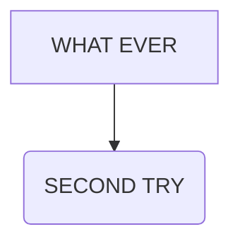
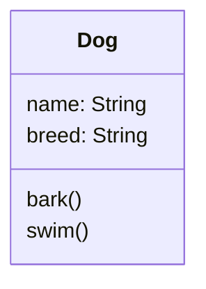

<h1>Chat python and marketing</h1>

---
## Table of Contents
- [Table of Contents](#table-of-contents)
- [Python learning Doc](#python-learning-doc)
- [Sample Mermaid Diagram](#sample-mermaid-diagram)

## Python learning Doc
[Python Learning code samples](python/doc/python.md)

## Sample Mermaid Diagram

