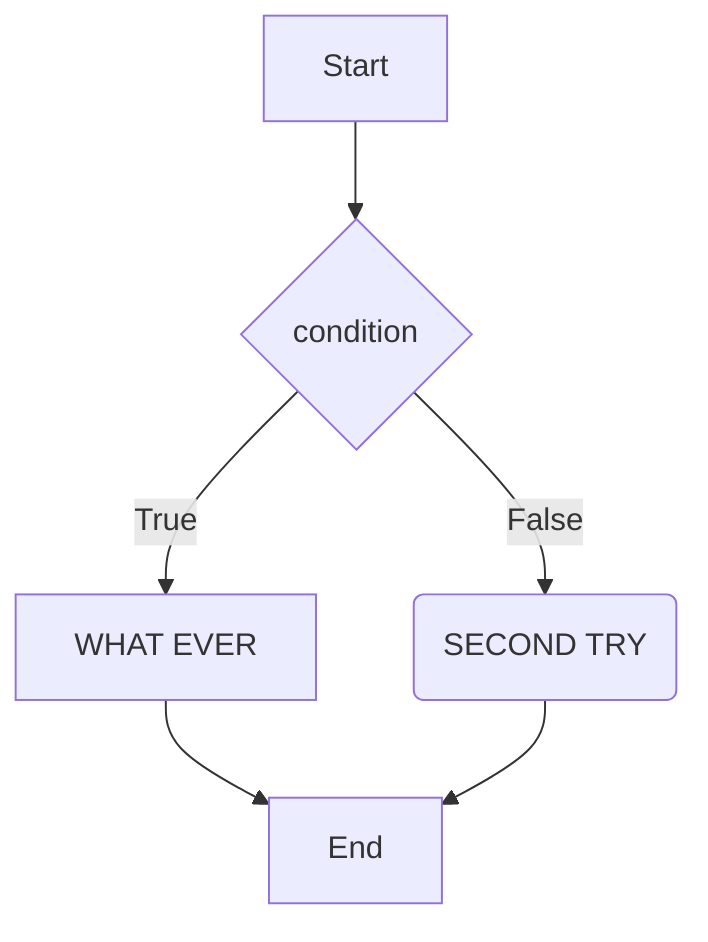
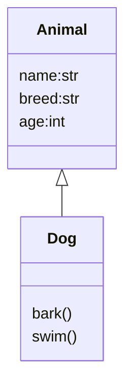

<h1>Chat python and marketing</h1>

---
## Table of Contents
- [Table of Contents](#table-of-contents)
- [env prompt](#env-prompt)
- [Python learning Doc](#python-learning-doc)
- [DataFrame Document](#dataframe-document)
- [Sample Mermaid Diagram](#sample-mermaid-diagram)

## env prompt
[one time teal, add one line in settings.json](.vscode/settings.json)

```json
{
    "terminal.integrated.defaultProfile.windows": "Command Prompt"

}
```
1. open python file (.py)
2. add cmd terminal

## Python learning Doc
[Python Learning code samples](python/doc/python.md)

## DataFrame Document
[document](https://pandas.pydata.org/docs/reference/api/pandas.DataFrame.html)

## Sample Mermaid Diagram



