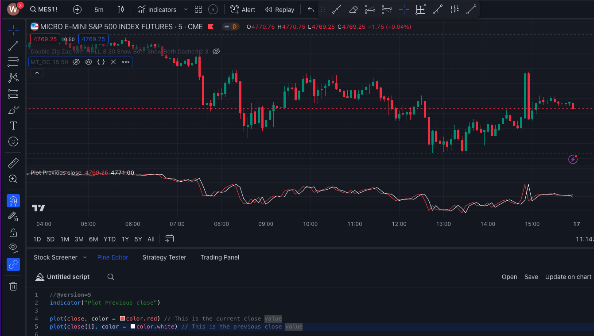

# Plot

1. HOW TO PLOT PREVIOUS CLOSE VALUE ?

```c
//@version=5
indicator("Plot Previous close")

plot(close, color = color.red) // This is the current close value
plot(close[1], color = color.white) // This is the previous close value
```



Comparison between current and previous close value

2. HOW TO PLOT OHLC VALUES ?

```c
//@version=5
indicator("Plot OHLC")

plot(open)
plot(high, 'high', color.green)
plot(low, color = color.red)
plot(close, color = color.white)
```

3. HOW TO PLOT A BAR ?

```c
//@version=5
indicator("Plot Bar")

barColor = (close > open) ? color.green : color.red
plotbar(open, high, low, close, title="BAR", color=barColor)
```

4. PLOT CANDLE

```c
//@version=5
indicator("Plot candle")

barColor = (close > open) ? color.green : color.red
plotcandle(open, high, low, close, title="BAR", color = barColor)
```

5. PLOT ARROW

```c
//@version=5
indicator("Plot arrow", overlay = true)

arrowType = close - open
plotarrow(arrowType, title ="Arrow", colorup = color.green, colordown = color.red, minheight = 12, maxheight = 50)
```

6. PLOT CHARACTER AND TEXT

```c
//@version=5
indicator("Plot char", overlay = true)

bullish = close > open
bearish = close < open

plotchar(bullish, char="^", location = location.belowbar, color= color.green, text = "bullish", textcolor = color.white, size = size.tiny)
plotchar(bearish, char="$", location = location.abovebar, color= color.red, text = "bearish", textcolor = color.white, size = size.tiny)
```

7. PLOT SHAPE AND TEXT

```c
//@version=5
indicator("Plot shape", overlay = true)

diff = close > open

plotshape(diff, title = "SHAPE", style = shape.diamond, location = location.abovebar, color= color.orange, text = "bullish", textcolor = color.green, size = size.tiny)
```

8. INDICATOR SCREENER

```c
//@version=5
indicator("indicator Screener", overlay = true)

length = input.int(defval = 200, title = "Length")
htf = input.timeframe(defval = "15", title = "Higher timeframe")

myScreener(stock) =>
_close = request.security(stock, htf, close1, gaps = barmerge.gaps_off, lookahead = barmerge.lookahead_on)
ema = ta.ema(close, length)
emaHtf = request.security(syminfo.tickerid, htf, ema1, gaps = barmerge.gaps_off, lookahead = barmerge.lookahead_on)
isUp = _close > emaHtf ? "YES" : "NO"


var tbl = table.new(position = position.bottom_right, columns = 2, rows = 10, bgcolor = color.white, border_width = 1)

table.cell(tbl, 0, 0, "STOCK", text_color = color.white, bgcolor = color.orange)
table.cell(tbl, 0, 1, "TSLA", text_color = color.white, bgcolor = color.green)
table.cell(tbl, 0, 2, "AAPL", text_color = color.white, bgcolor = color.green)
table.cell(tbl, 0, 3, "MSFT", text_color = color.white, bgcolor = color.green)
table.cell(tbl, 0, 4, "GOOG", text_color = color.white, bgcolor = color.green)

table.cell(tbl, 1, 0, "STOCK above 200 EMA")
table.cell(tbl, 1, 1, str.tostring(myScreener("TSLA")))
table.cell(tbl, 1, 2, str.tostring(myScreener("AAPL")))
table.cell(tbl, 1, 3, str.tostring(myScreener("MSFT")))
table.cell(tbl, 1, 4, str.tostring(myScreener("GOOG")))
```

9. PLOT HORIZONTAL LINE FROM A CUSTOM POINT

```c
//@version=5
indicator("Draw a Horizontal Line From Certtain Bar", overlay = true)

ema = ta.ema(close, 200)

plot(ema, color = color.gray)

xEma = ta.cross(close, ema)

barIndexWhenCross = ta.valuewhen(xEma, bar_index, 0)
highValueWhenCross = ta.valuewhen(xEma, high, 0)
// timeWhenCross = ta.valuewhen(xEma, time, 0)

my_line = line.new(barIndexWhenCross, highValueWhenCross, barIndexWhenCross + 1, highValueWhenCross, color = color.green, extend = extend.right)
line.delete(my_line1)
```

10. PLOT VIX

```c
//@version=5
indicator("VIX")

vix = request.security("VIX", "D", close1, gaps = barmerge.gaps_off, lookahead = barmerge.lookahead_on)

plot(vix, color = color.gray, style = plot.style_stepline)
```

11. SHOW DIFFERENT STOCK'S CANDLES ON THE CURRENT CHART

```c
//@version=5
indicator("Show Different Stock's Candles")

stock_name = input.symbol("TSLA", "Choose Stock")
htf = input.timeframe("D", "timeframe")

stock_open = request.security(stock_name, htf, open, gaps = barmerge.gaps_off, lookahead = barmerge.lookahead_on)
stock_high = request.security(stock_name, htf, high, gaps = barmerge.gaps_off, lookahead = barmerge.lookahead_on)
stock_low = request.security(stock_name, htf, low, gaps = barmerge.gaps_off, lookahead = barmerge.lookahead_on)
stock_close = request.security(stock_name, htf, close, gaps = barmerge.gaps_off, lookahead = barmerge.lookahead_on)

candel_color = stock_close > stock_open ? color.green : stock_close < stock_open ? color.red : color.white

plotcandle(open = stock_open, high = stock_high, close = stock_close, low = stock_low, color = candel_color)
```

12. GET LOWER TIMEFRAME DATA

```c

//@version=5
indicator("Get Lower Timeframe Data", overlay = true)

htf = input.timeframe("D", "timeframe")

lowertf_open, lowertf_high, lowertf_low, lowertf_close = request.security_lower_tf(syminfo.tickerid, htf, open, high, low, close, true, ignore_invalid_timeframe = true)

// Plot lower timeframe data if available
lowertfCloseValue = na(lowertf_close0) ? na : array.get(lowertf_close, 0)
plot(lowertfCloseValue, color=color.red, title="Lower Timeframe Close")
```

```c
// Input for higher timeframe
htf = input.timeframe("D", "Higher Timeframe")

// Request lower timeframe data
lowertf_open, lowertf_high, lowertf_low, lowertf_close = request.security_lower_tf(syminfo.tickerid, htf, open, high, low, close, true, ignore_invalid_timeframe=true)

// Plot higher timeframe data
plot(close, color=color.blue, title="Higher Timeframe Close")

// Plot lower timeframe data if available
lowertfCloseValue = na(lowertf_close0) ? na : array.get(lowertf_close, 0)
plot(lowertfCloseValue, color=color.red, title="Lower Timeframe Close")
```

13. HIDE THE INDICATOR SETTINGS

```c
//@version=5
indicator("Hide indicator Settings", overlay = true)

plot(close, style = plot.style_stepline_diamond, editable = false)
```
