<h1> PINE Learning Notes </h1>

细节决定成败！

TreadingView is best tool for automatic stock buy/sell.

- [Getting Started](#getting-started)
- [Basics](#basics)
- [使用用户手册](#使用用户手册)
  - [ta.ema()](#taema)
  - [overlay](#overlay)
- [对接交易所下单](#对接交易所下单)
- [Stratege](#stratege)
- [回测](#回测)
  - [strategy.entry](#strategyentry)
  
## Getting Started
* install TreadingView software
[Download Website](https://www.tradingview.com/desktop/)
File: TradingView.msix

## Basics
* [Day-1 画图](https://www.youtube.com/watch?v=6Nz2iPXo3xg)
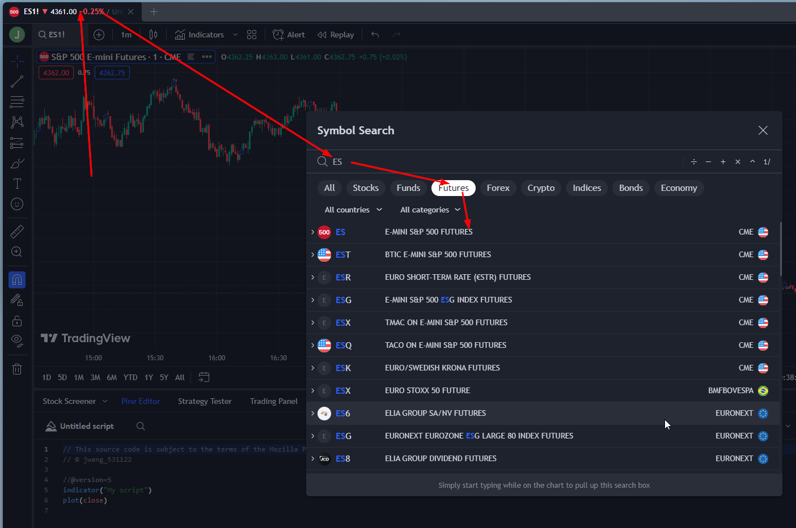

* create new indicator
  - 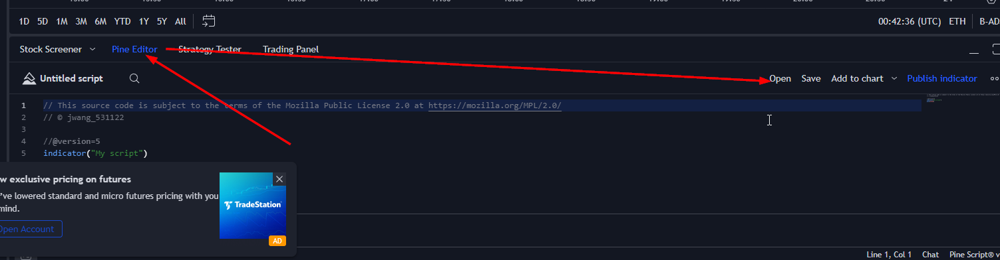<br>
  - 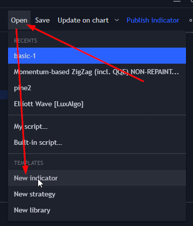
  - 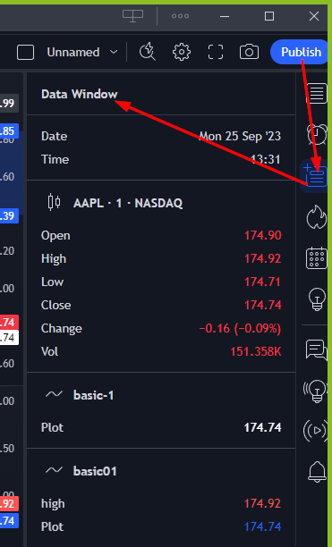
  
[first indicator](src/indicator01.pi)

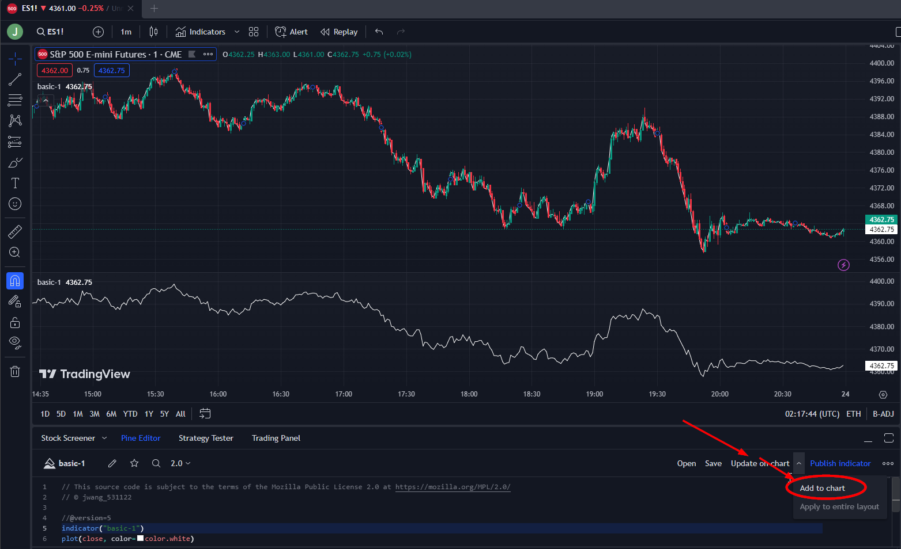

## 使用用户手册
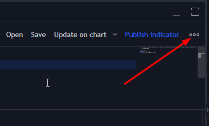 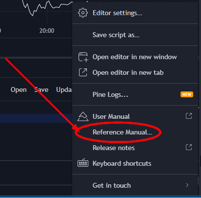

* [Day-2 金叉⋅死叉⋅报警](https://www.youtube.com/watch?v=1FxV9K9W9Vo)

### ta.ema() 

name|type|meaning
|---|---|---|
ta|class|Technical Analysis
ema|function|Exponential Moving Average

[金叉⋅死叉 buy & sell](src/indicator02.pi)

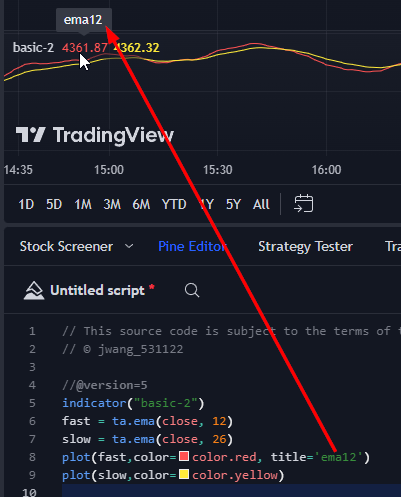
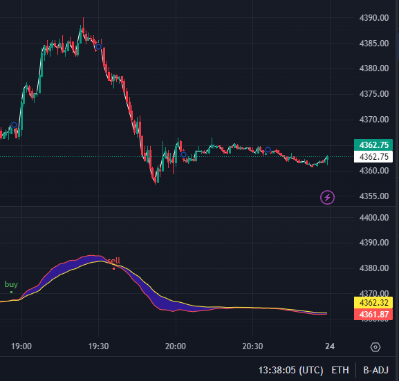
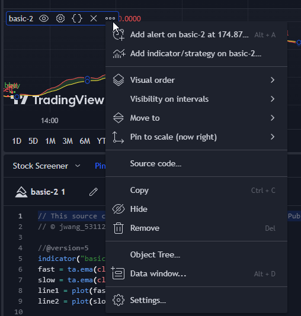

### overlay
```py
indecator("basic02", overlay = true)
```

* [Day-3](https://www.youtube.com/watch?v=1yOFqMzrjWM&list=PL8nVz3ceLBeDRy9EFzd8Adux40Rxz94yi&index=9)

## 对接交易所下单
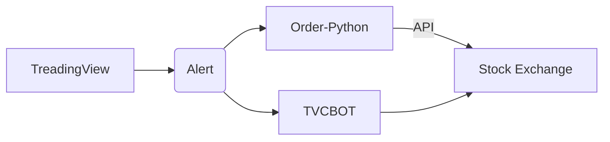

## Stratege

Open -> new Stratege

[first stratege](src/strategy01.pi)
Save ⟹ Strategy Tester(tab) ⟹ Load your strategy ⟹ 

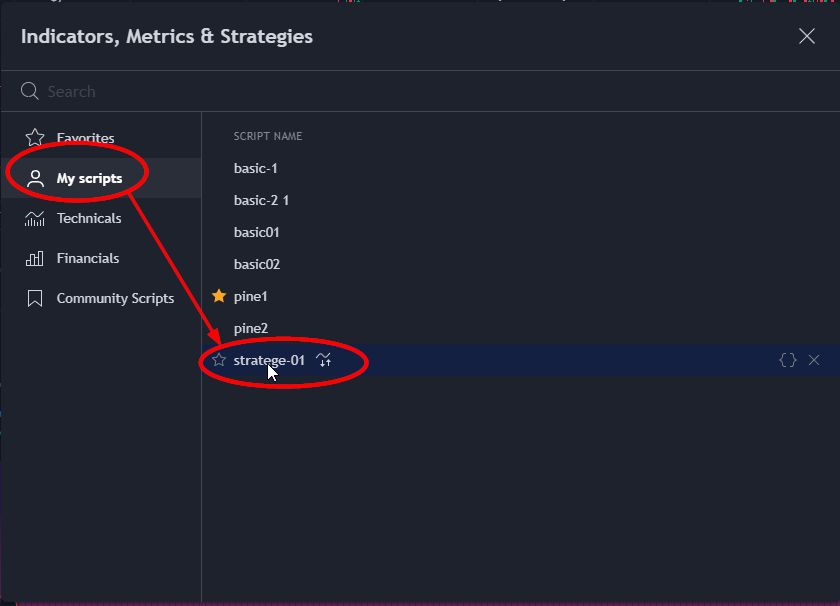

[MACD strateg from 邢](src/strategy02.pi)

## 回测

### strategy.entry
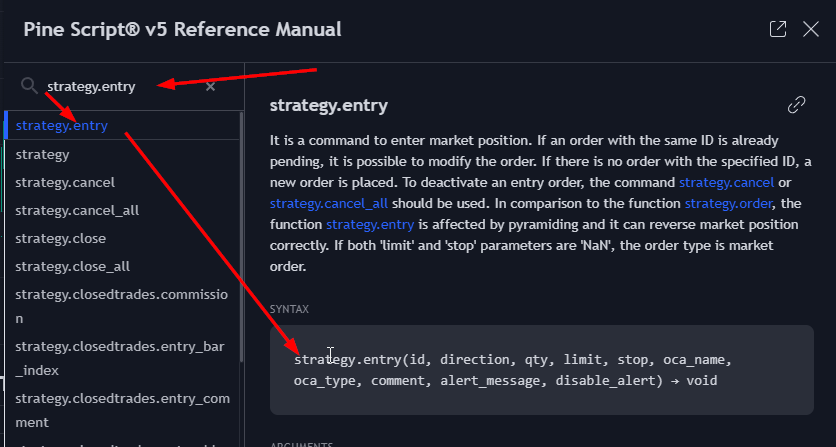
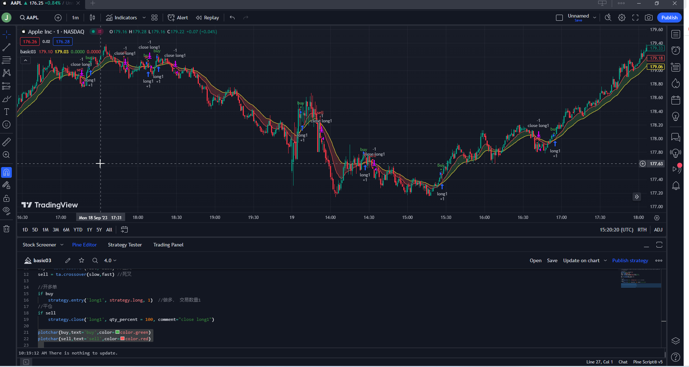
[](src/)