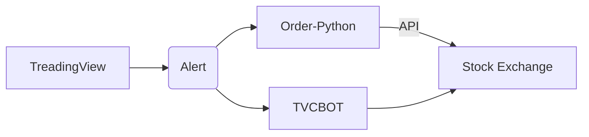
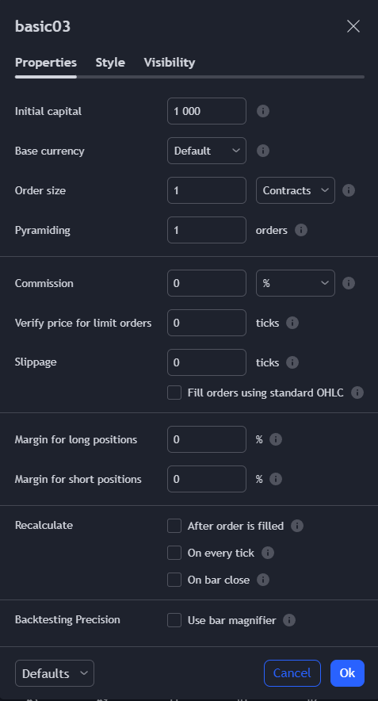
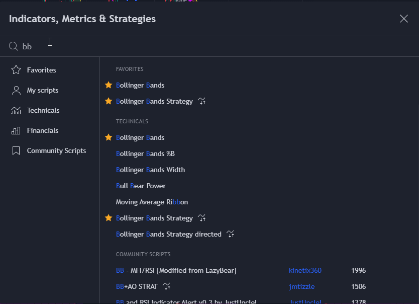
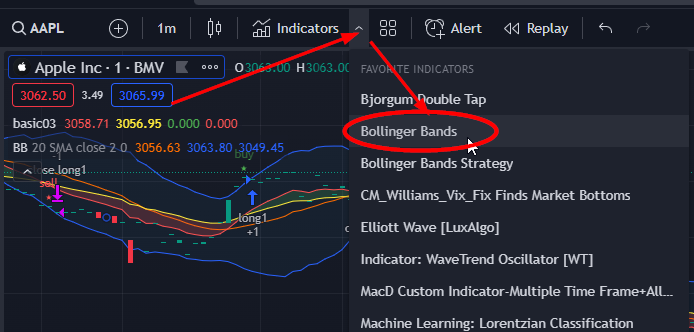
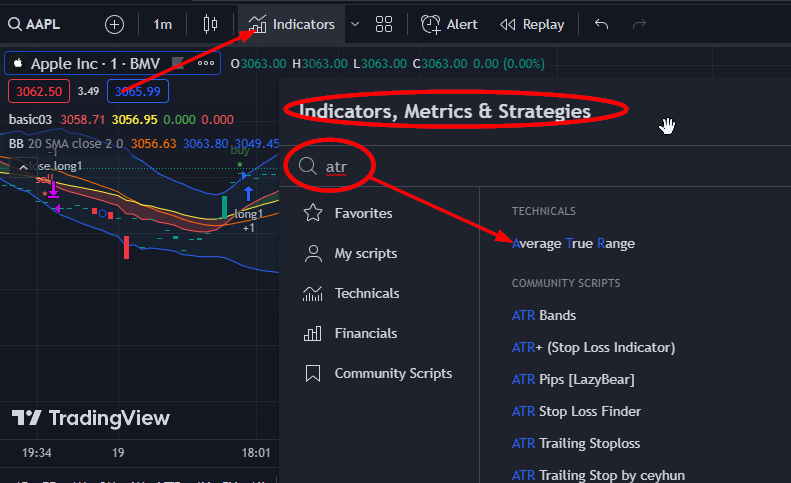
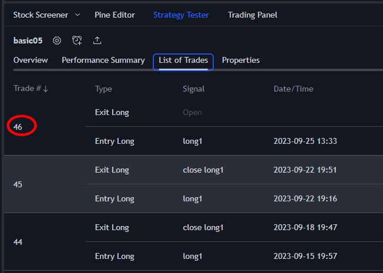
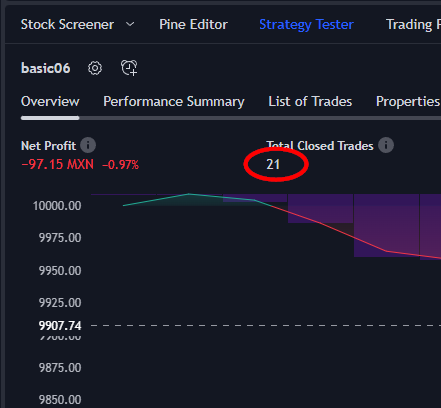
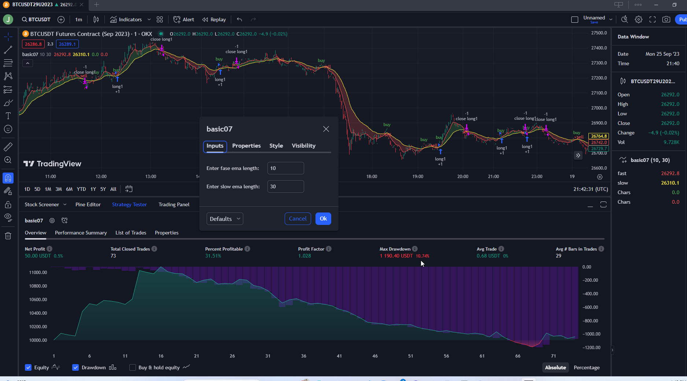

<h1> PINE Learning Notes </h1>

细节决定成败！

TreadingView is best tool for automatic stock buy/sell.

- [Getting Started](#getting-started)
- [Basics](#basics)
- [使用用户手册](#使用用户手册)
  - [ta.ema()](#taema)
  - [overlay](#overlay)
- [对接交易所下单](#对接交易所下单)
- [Strategy](#strategy)
- [回测](#回测)
  - [strategy.entry](#strategyentry)
  - [Strategy Properties](#strategy-properties)
- [Boolinger Band](#boolinger-band)
- [ATR](#atr)
- [MACD](#macd)
  
## Getting Started
[TradingView Pine script language Document](https://www.tradingview.com/pin-script-docs)
* install TreadingView software
> Download Website: [Download Website](https://www.tradingview.com/desktop/)
File: TradingView.msix

## Basics
* [Day-1 画图](https://www.youtube.com/watch?v=6Nz2iPXo3xg)


* create new indicator
  - <br>
  - 
  - 
  
> Source Code: [first indicator](src/indicator01.pine)


## 使用用户手册
 

* [Day-2 金叉⋅死叉⋅报警](https://www.youtube.com/watch?v=1FxV9K9W9Vo)

### ta.ema() 

name|type|meaning
|---|---|---|
ta|class|Technical Analysis
ema|function|Exponential Moving Average

> Source Code: [金叉⋅死叉 buy & sell](src/indicator02.pine)


### overlay
```py
indecator("basic02", overlay = true)
```

* [Day-3](https://www.youtube.com/watch?v=1yOFqMzrjWM&list=PL8nVz3ceLBeDRy9EFzd8Adux40Rxz94yi&index=9)

## 对接交易所下单


## Strategy

Open -> new Stratege

> Source Code: [first strategy](src/strategy01.pine)
Save ⟹ Strategy Tester(tab) ⟹ Load your strategy ⟹ 


> Source Code:[MACD strategy from 邢](src/strategy02.pine)

## 回测

### strategy.entry


> Source Code: [自动开单平仓，回测结果](src/strategy03.pine)


### Strategy Properties



## Boolinger Band

Select Favorite first, then there is a dropdown beside the indicator tool bar


## ATR

ATR: Average True Range

> Source Code: [add atr to buy](src/strategy05.pine)

```sh
// ATR 满足上涨条件: 今天的atr大于前两天的atr
atr = ta.atr(14)[0]>ta.atr(14)[2]

//开多单
if buy and atr
    strategy.entry('long1', strategy.long, 1)  //做多， 交易数量1
```


Add volume condition
> Source Code: [add volume codition to reduce trades](src/strategy06.pine)


Accept user input
> Source Code: [add input to replace variable](src/strategy07.pine)
Right-click ==> Strategy Properties



👍😄 **Conclusion**
> fast and slow ema length are very sensitive to number of trade, and P/L (Profit/loss).

## MACD
MACD, which stands for Moving Average Convergence Divergence