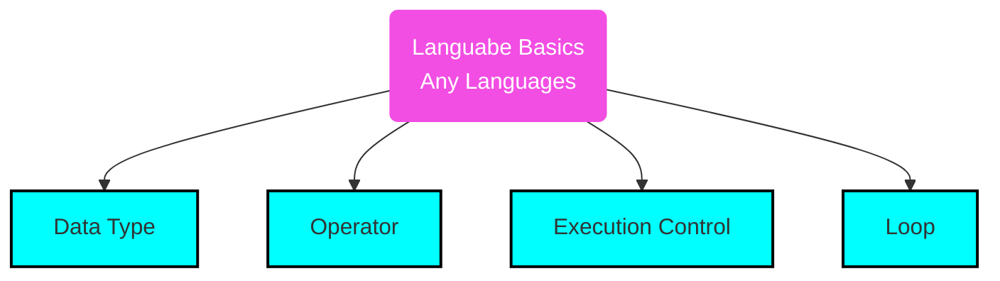
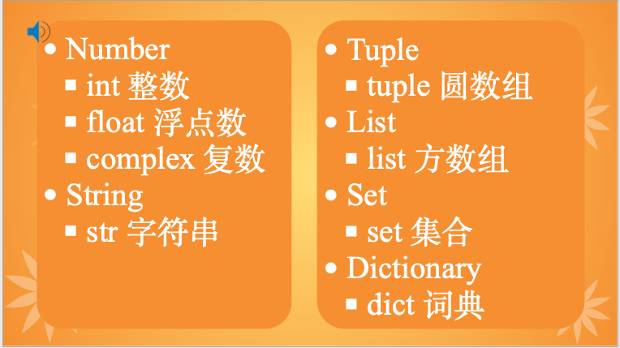
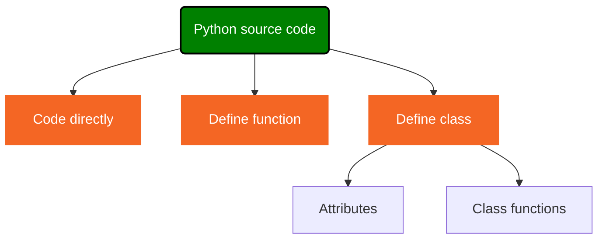
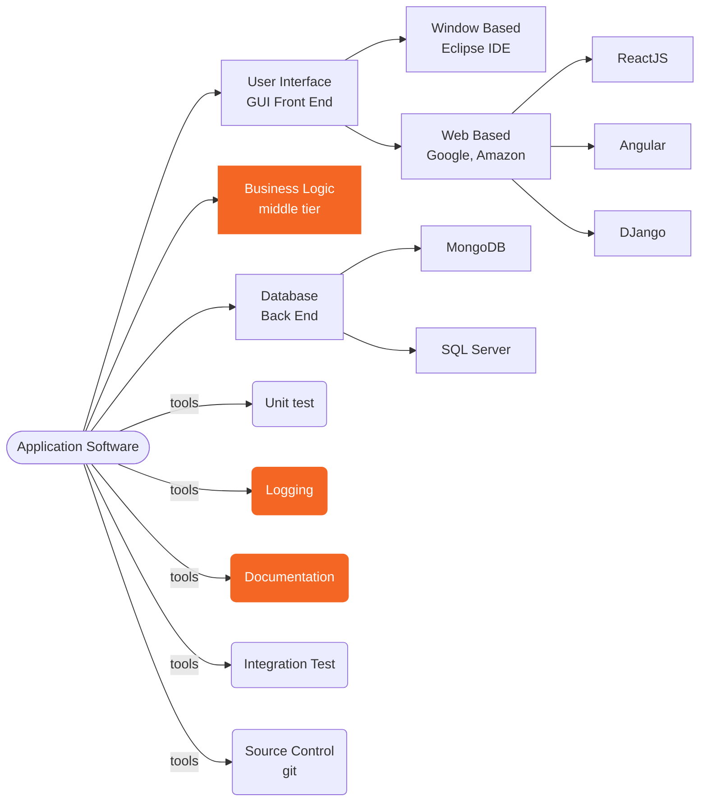

<h1>Python Learning Notes</h1>

## Table of Contents
- [Table of Contents](#table-of-contents)
- [Getting Started](#getting-started)
- [Data Type](#data-type)
  - [Number](#number)
  - [String](#string)
  - [tuple](#tuple)
  - [list](#list)
  - [set](#set)
  - [dict](#dict)
  - [developer defined datatype](#developer-defined-datatype)
- [Operator](#operator)
  - [arithmatic operators](#arithmatic-operators)
  - [assignment operators](#assignment-operators)
  - [comparison operators](#comparison-operators)
  - [identity Operator](#identity-operator)
  - [logic operators](#logic-operators)
  - [membership](#membership)
  - [ternary](#ternary)
- [Execution Control](#execution-control)
- [Loop](#loop)
- [Function](#function)
  - [global variable](#global-variable)
- [yield keyword](#yield-keyword)
- [try-except](#try-except)
- [documentation](#documentation)
- [logging](#logging)
- [class](#class)


## Getting Started
* [sample print code](../src/print.py)

get into python playground
```
C:\Users\wangq\workspace\students\hov\python>python
>>> help(print)
>>> dir(__builtins__)
```



## Data Type


### Number
* [Number](../src/basics/datatype/number.py)

### String
* [sample code for str](../src/basics/datatype/string.py)
> 1. str variable is group of letter or number surounded by '...', "...", '''...''', """..."""
> 2. string is iterable
> 3. string is immutable
> 4. string slicing; [start:stop:step]
> 5. string operator: *, +, .
> 6. available function: str(), isdecimal(), isalpha(), isalnum(), upper(), strip(), slit()
> 7. use len() built-in function can find number of letters in a string variable
> 8. str() can be used as function to convert other type to str.

### tuple
* [sample code for tuple](../src/basics/datatype/tuple.py)
> 1. tuple variable is group of any python object surounded by (), separated by comma
> 2. tuple is iterable
> 3. tuple is immutable
> 4. tuple slicing; [start:stop:step]
> 5. tuple operator: *, +, .
> 6. available function: count()
> 7. use len() built-in function can find number of elements in a tuple variable
> 8. tuple() can be used as function to convert other type to tuple.

### list
* [sample code for list](../src/basics/datatype/list.py)
> 1. list variable is group of any python object surounded by [], separated by comma
> 2. list is iterable
> 3. list is mutable which means it can be changed.
> 4. list slicing; [start:stop:step]
> 5. list operator: *, +, .
> 6. available function: count(), append(), insert(), ...
> 7. use len() built-in function can find number of elements in a list variable
> 8. list() can be used as function to convert other type to list.

### set
* [sample code for set](../src/basics/datatype/set.py)
> 1. **set** variable is group of any unordered python object surounded by {}, separated by comma, no duplicated elements.
> 2. set is iterable
> 3. set is mutable which means it can be changed.
> 4. set cannot slicing; 
> 5. set has operators
>   - &: intersection operator
>   - |: union operator
>   - >: greater than
>   - <: less than
>   - ==: equal
>   - .: dot operator (for function call)
> 6. available function: add(), remove(), ...
> 7. use len() built-in function can find number of elements in a set variable
> 8. set() can be used as function to convert other type to set.

### dict
* [sample code for dictionary](../src/basics/datatype/dict.py)
> 1. dict variable is group of any unordered python object key:value pair surounded by {}, separated by comma, which cannot have duplicated key.
> 2. dict is iterable
> 3. dict is mutable which means it can be changed.
> 4. dict no slicing
> 5. dict operator: **, .
> 6. available function: , ...
> 7. use len() built-in function can find number of key:value pairs in a dict variable
> 8. dict() can be used as function to convert other type to dict.
> 9. only immutable or hashable datatype can be used as key (such as number,tuple,str)

### developer defined datatype
* [all classes written by developer are new data type in python](../src/basics/datatype/person.py)

## Operator
### [arithmatic operators](../src/basics/operators/arithmetic.py)
> Arithmetic operators: +; -; *; /; %; **; // (floor divisor)

### [assignment operators](../src/basics/operators/assignment.py)
> Assignment operators: =; +=; -=; *=; /=; %=; **=; //= 

### [comparison operators](../src/basics/operators/comparison.py)
> == Equal
> != Not Equal
> \> Greater than
> <  Less than
> \>= Greater than or equal to
> <= Less than or equal to

### [identity Operator](../src/basics/operators/identity.py)
> is
> is not

### [logic operators](../src/basics/operators/logical.py)
> and
> or
> not

### [membership](../src/basics/operators/membership.py)
1. in
2. not in

### [ternary](../src/basics/operators/ternary.py)
1. a if a<b else b
2. a>b and a or b

Sample code for using data type and operator to do pythong program.

* [calculate circle area](../src/basics/circle.py)
* [weekday](../src/basics/weekdays.py)
* [triangle area by given base and height](../src/basics/triangle.py) 

## Execution Control

if-elif-else syntax

```py
if <condition> :
  <code block>
elif <condition> :
  <code block>
else:
  <code block>
```


* [if-else sample code](../src/basics/ifelse.py)

## Loop
* [simple for loop](../src/basics/forLoop.py)
* [continue in for loop](../src/basics/forLoopContinue.py)
* [break in for loop](../src/basics/forLoopBreak.py)



## Function
the Syntax of defining function

```
def <function name> ([arguments list]):
  <code block>
```

* [sample code to define function](../src/function/func01.py)
* [understand positional and keyword argument](../src/function/functionArguments.py)

🔑💡 **Knowlodge Base**
1. positional arguments always put before key-words argument;
2. the order of key-words arguments does not matter;
3. keyword arguments must provide values(either on define or on calling);
4. if keyword arguments have default value, it is ok to call without them;
5. all positional values must to be provided in the order of definition;

* [optional arguments](../src/function/optionalArguments.py)

* [Define a function inside another function](../src/function/functionInFunction.py)

💡🔑 **Knowlodge Base**
> 1. define function for calling more than one time;
> 2. pass a function as a argument;
> 3. define a function in another function;
> 4. return a function from another function;

* [Pass function as argument](../src/function/passFunction.py)
* [myTimer wrapper function add timer in original](../src/function/mytimer1.py)
* [myTimer wrapper function add return value](../src/function/mytimer2.py)
* [myTimer wrapper function add wrraper decorator](../src/function/mytimer3.py)

### global variable
❓ What is global variable?
>✔️global keyword allows you to modify the variable outside of the current scope. It is used to create a global variable and make changes to the variable in a local context.

[use global variable](../src/function/globalVariable.py)
1. When we create a variable inside a function, it is local by default.
2. When we define a variable outside of a function, it is global by default. You don't have to use global keyword.
3. We use global keyword to read and write a global variable inside a function.
4. Use of global keyword outside a function has no effect.
5. It is not necessary to declare global variable outside function


> Understand 
```py
if __name__ == '__main__':
```

💡🔑 **Knowlodge Base**
> 1. when running the module, python assign __name__='__main__', so the condition is True, and then the test code within the if block will be run.
> 2. when import from other module, python assign __name__=<module name>, so that the if condition is False, and then the test code within the if block will **NOT** be run.

* [understand if __name__](../src/function/passFunction.py) <-- [](../src/function/test.py)

## yield keyword
* [yield is similar to return](../src/function/yield1.py)
* [yield allow you to do math](../src/function/yield2.py)
* [yield in while loop](../src/function/yield3.py)
* [async yield，不见不散-死等](../src/function/yield4.py)

## try-except

* [raise Error](../src/function/raiseError.py)
* [assert statement](../src/function/assert.py)
* [custom error type](../src/function/myError.py)
    
```py
try:
  r = -3
  area = circleArea(r)
  print(area)
except Exception as err:
  print(err)
```



## documentation

* [python documentation](../src/function/doc.py)
  
## logging

* [](../src/function/logging01.py)
* 

## class
* [do nothing class](../src/class/class01.py)
* [understand __init__(), and __repr__()](../src/class/class02.py)
* [understand self](../src/class/class03.py)
* [understand __len__()](../src/class/class04.py)
* [start by 1, include stop range class, __iter__(), __next__()](../src/class/range1.py)