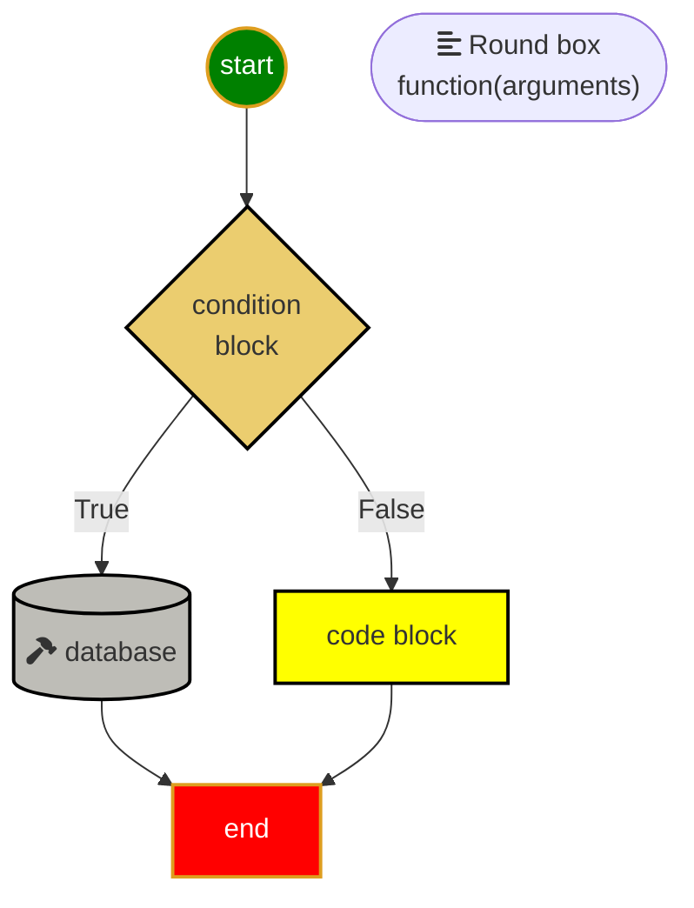
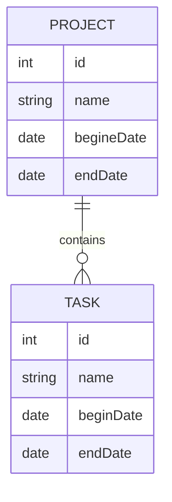
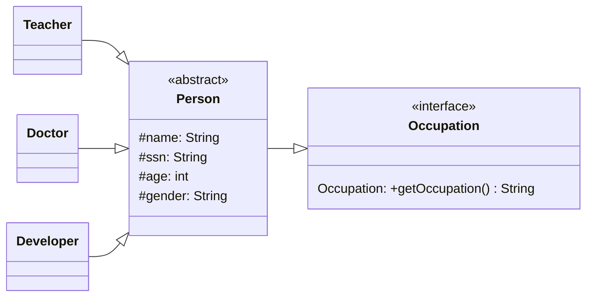

## Useful Icons

❓>✔️ 📌❗️ 👍😄 👎😱 👎😢❌✔️ 💡👉 🔔⚡️ 🔒🔑🔥⚡️ ☝️👌
✏️📄✂️♻️
📝🔍🔨☝️😢👇👈👉👍👎👌👊⭐️👎😢🌎💾🗑🐛📒⚠️📐🛠🎯✉️☎️

:hammer:
:department_store:
:gear:

## Change image size

[](images/bug.png) [](images/waiting.gif)

## references
* [Color Picker](https://www.webfx.com/web-design/color-picker/)
* [favorite icon website](https://www.webfx.com/tools/emoji-cheat-sheet/)
* [YouTube Google Classroom](https://www.youtube.com/watch?v=5yoKprcfHR8&t=1509s)

## Notations
🔑💡 **Knowlodge Base**
👍😄 **Conclusion**
📝🔍 **Source Code**
❌😢 **Mistake:**
👌😄 **Reasong:**
✔️😄 **Solution:**

## Fast way to learn something new:
  1. DIY (do it yourself);
  2. learn from mistake;
  3. repeat;
  4. take good note for future review;
  5. teach someone else.

## 汉语拼音韵母声号
第一声（阴平，或平调，¯）：
ā (ɑ̄) ē ī ō ū ǖ Ā Ē Ī Ō Ū Ǖ
第二声（阳平，或升调，ˊ）：
á (ɑ́) é í ó ú ǘ Á É Í Ó Ú Ǘ
第三声（上声，或上音，ˇ）：
ǎ (ɑ̌) ě ǐ ǒ ǔ ǚ Ǎ Ě Ǐ Ǒ Ǔ Ǚ
第四声（去声，或去音，ˋ）：
à (ɑ̀) è ì ò ù ǜ À È Ì Ò Ù Ǜ
轻声，不标符号：
a (ɑ) e i o u ü A E I O U Ü

## math symbols
|operator | LaTex Symbols |
|---------|---------------|
× | times
÷ | div
± | pm
° | degree
∞ | infty
ϕ | phi
Φ | Phi
Θ | Theta
θ | theta
Ω | Om
α | alpha
β | beta
γ | gamma
δ | delta
μ | mu
π | pi
λ | lambda
ω | omega
⇒ | Rightarrow
⟹| Longrightarrow
⇓ | Downarrow


## Sample File Structure:

```output
<project root>
    ├── 📝doc/
    |    ├── mistakes.md 
    |    └── python.md 
    ├── 🔨homeworks/
    |       └── filenameXX.md
    ├── 🔥src/
    |       └── string.py
    └── 👉ReadMe.md
```

## Sample Mermaid Graph Diagram

😄Include frequently used mermaid diagram features below👇



## Simple Mermaid Relational Diagram



## Simple Mermaid Class Diagram

